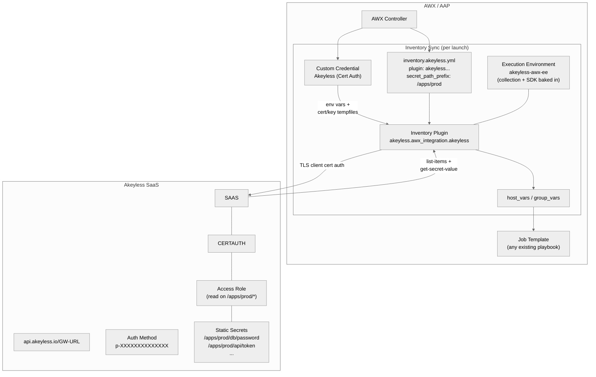

# Akeyless + AWX/AAP Integration

An Ansible Collection that wires [Akeyless](https://www.akeyless.io/) secrets
into [AWX](https://github.com/ansible/awx) and
[Ansible Automation Platform](https://www.ansible.com/products/automation-platform)
at the platform level. Playbooks consume the secrets as ordinary Ansible
variables. There are no `akeyless login` tasks, no lookup expressions, and no
Akeyless code in any playbook.

The audience is platform engineers and AWX/AAP administrators who run
playbooks against Akeyless at scale and want one place to configure
authentication and secret retrieval.

## What problem this solves

Customers operating AWX/AAP against Akeyless typically embed explicit
`akeyless login` and `akeyless get-secret-value` tasks inside every play.
That couples every playbook to Akeyless, multiplies the maintenance
surface, and makes credential rotation or secret addition expensive.

This collection moves the integration up one layer.

| Concern | Where it lives now |
|---|---|
| Authentication to Akeyless | An AWX Custom Credential Type, configured once. The collection ships three: cert, API-key, and Kubernetes auth. |
| Secret retrieval | An Ansible Inventory Plugin that runs at inventory-sync time and lands values as `host_vars` and `group_vars`. |
| Adding a new secret | Create it under the configured path in Akeyless. The next inventory sync picks it up. No AWX or playbook change. |
| Rotating a secret | Rotate it in Akeyless. The next inventory sync picks up the new value. No AWX or playbook change. |

## Relationship to `akeyless.secrets_management`

There are two Akeyless Ansible collections, and they do different things.

| Collection | Maintainer | Purpose |
|---|---|---|
| [`akeyless.secrets_management`](https://galaxy.ansible.com/ui/repo/published/akeyless/secrets_management/) | Akeyless | The official collection. Provides lookup plugins (`get_secret_value`, `get_dynamic_secret_value`, others) and a `module_utils` Python layer that wraps the Akeyless API client and authenticator. Called from inside playbooks. |
| `akeyless.awx_integration` (this repo) | Community | An AWX/AAP layer on top of the official collection. Provides an inventory plugin, an AWX Custom Credential Type, and an Execution Environment build context. Wires Akeyless into AWX once at the platform level so playbooks contain no Akeyless code. |

This collection takes a hard runtime dependency on
`akeyless.secrets_management`. The inventory plugin imports its
`AkeylessAuthenticator` and `AkeylessHelper` rather than re-implementing
them. Both collections must be installed in your Execution Environment.

## Table of contents

| # | Document | Description |
|---|---|---|
| 1 | [Architecture overview](runbooks/01-architecture-overview.md) | Components, data flow, and a mermaid diagram of an inventory sync end to end. |
| 2 | [Prerequisites](runbooks/02-prerequisites.md) | Tools, access, and information to gather before starting. |
| 3 | [Execution Environment](runbooks/03-execution-environment.md) | Use the published reference EE or build your own with `ansible-builder`. |
| 4 | [Akeyless cert-auth verification](runbooks/04-akeyless-cert-auth.md) | Confirm cert auth works against the SaaS API before touching AWX. |
| 5 | [AWX Custom Credential Type](runbooks/05-awx-credential-type.md) | Register the credential type and create a credential of that type. |
| 6 | [Inventory source configuration](runbooks/06-inventory-source.md) | Project, inventory, and inventory-source wiring with the credential and EE. |
| 7 | [First sync and test job](runbooks/07-first-sync-and-job.md) | Run the inventory sync, verify host_vars, run a playbook end to end. |
| 8 | [Day-2 operations](runbooks/08-day-2-operations.md) | Rotation, adding and removing secrets, revocation, EE refresh and pinning. |
| 9 | [Troubleshooting](runbooks/09-troubleshooting.md) | Categorized failure modes with diagnoses and fixes. |

## Architecture at a glance



For the data-flow walkthrough that maps each arrow to a step, see
[`runbooks/01-architecture-overview.md`](runbooks/01-architecture-overview.md).

## Repository layout

| Path | What it is |
|---|---|
| `plugins/inventory/akeyless.py` | The inventory plugin. FQCN `akeyless.awx_integration.akeyless`. |
| `extensions/awx/credential_types/akeyless_cert_auth.yml` | Source YAML for the cert-auth Custom Credential Type. |
| `extensions/awx/credential_types/akeyless_api_key.yml` | Source YAML for the API-key Custom Credential Type. |
| `extensions/awx/credential_types/akeyless_k8s_auth.yml` | Source YAML for the Kubernetes-auth Custom Credential Type. |
| `ee/` | `ansible-builder` v3 context that produces the reference Execution Environment image. |
| `ee/execution-environment.yml` | EE definition: base image, collections, Python deps. |
| `ee/requirements.txt` | Python deps baked into the EE (currently the `akeyless` SDK). |
| `meta/runtime.yml` | Minimum ansible-core version (`>=2.15.0`). |
| `galaxy.yml` | Collection metadata: namespace, name, version, dependencies, `build_ignore`. |
| `runbooks/` | Numbered operator runbooks (this guide). |
| `tests/integration/awx-setup.yml` | Reference provisioning playbook that stands up the credential type, EE, project, inventory source, and job template against a real AWX instance using `awx.awx` modules. |
| `tests/integration/project/` | Sample project tree (inventory YAML and example playbook) the provisioning playbook points AWX at. |
| `.github/workflows/ee-build.yml` | Weekly and on-change rebuild of the published EE image, plus a Trivy scan. |
| `.github/workflows/ee-scan.yml` | Daily Trivy scan of the published `:latest` tag. |

## Quick start

1. Verify the [prerequisites](runbooks/02-prerequisites.md) are met.
2. Pick or build an [Execution Environment](runbooks/03-execution-environment.md).
3. [Verify Akeyless cert-auth](runbooks/04-akeyless-cert-auth.md) end to end with the CLI.
4. Register the [AWX Custom Credential Type](runbooks/05-awx-credential-type.md) and create a credential of that type.
5. Wire up the [inventory source](runbooks/06-inventory-source.md) using a project of inventory YAMLs.
6. Run the [first sync and a test job](runbooks/07-first-sync-and-job.md).

End-to-end happy path: about 20 minutes once cert auth works.

## Reference Execution Environment

A pre-built EE is published on GHCR for users who want to skip the build
step.

```
ghcr.io/fahmy-kadiri-akl/akeyless-awx-ee:0.1.0
```

It contains this collection, `akeyless.secrets_management`, and the
`akeyless` Python SDK. Public; pulls require no authentication. Rebuilt
every Monday by the `ee-build.yml` workflow and scanned daily by
`ee-scan.yml`.

To build your own image, for private registries, custom bases, or internal
supply-chain controls, see
[`runbooks/03-execution-environment.md`](runbooks/03-execution-environment.md).

## Compatibility

| Component | Version |
|---|---|
| AWX / AAP | Tested against AWX 24.6.1. Expected to work on any release that supports Custom Credential Types and per-source EEs. |
| ansible-core | `>=2.15.0` for this collection. `>=2.18.0` for `akeyless.secrets_management`. |
| Python (in the EE) | 3.12 (the `quay.io/ansible/awx-ee` default). |
| `akeyless.secrets_management` | `>=1.0.0` |
| `akeyless` Python SDK | `>=5.0,<6.0` |

## Why an inventory plugin instead of a credential plugin

AWX's first-class "Credential Plugin" / "External Secret Management Source"
mechanism, the one HashiCorp Vault and CyberArk use, requires modifications
to AWX itself. The AWX upstream is in a refactor and was not accepting new
credential plugins as of 2024-07.

An inventory plugin combined with a Custom Credential Type reaches the same
end-state: platform-level auth, no playbook changes, and dynamic secret
pickup. It does not require any change to AWX upstream.

## Additional resources

- [Akeyless documentation](https://docs.akeyless.io)
- [Akeyless cert-auth method](https://docs.akeyless.io/docs/auth-with-certificate)
- [`akeyless.secrets_management` on Galaxy](https://galaxy.ansible.com/ui/repo/published/akeyless/secrets_management/)
- [AWX Custom Credential Types](https://docs.ansible.com/automation-controller/latest/html/userguide/credential_types.html)
- [`ansible-builder` v3 docs](https://ansible.readthedocs.io/projects/builder/en/latest/)

## License

MIT. See [LICENSE](LICENSE).
