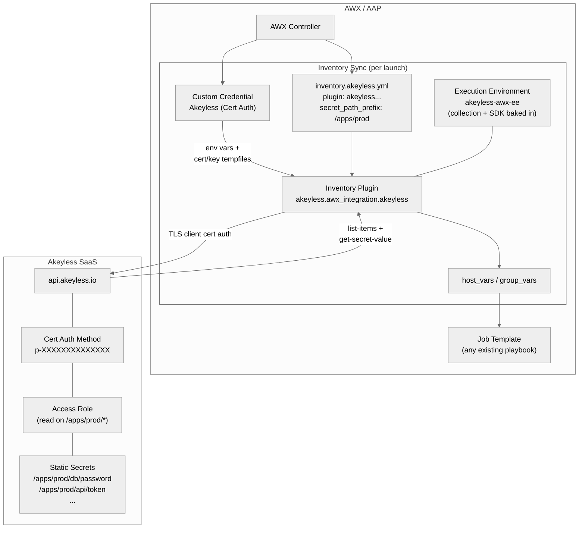

# Architecture Overview

This document describes how `akeyless.awx_integration` wires Akeyless secrets
into AWX/AAP at the platform level, the components involved, and the data
flow of a single inventory sync.

## Components

| Component | Role |
|---|---|
| Akeyless SaaS (`api.akeyless.io`) | Central secrets management. Stores secrets, manages access roles, performs the cert-auth handshake. |
| Akeyless cert auth method | An auth method whose `access_id` looks like `p-XXXXXXXXXXXXXX` and that trusts a specific CA. Cert-auth handshakes terminate at the SaaS API, not at a customer gateway (most gateway ingresses do not pass TLS client certs through). |
| Akeyless access role | Bound to the cert auth method. Grants `read` on the secret paths AWX will consume. |
| AWX / AAP Controller | Runs inventory syncs and job templates. Manages credentials, projects, inventories, and EEs. |
| Custom Credential Type | Defined by `extensions/awx/credential_types/akeyless_cert_auth.yml`. Declares the cred fields (`akeyless_api_url`, `access_id`, `cert_data`, `key_data`) and the injectors that write the cert and key to tempfiles and set `AKEYLESS_*` env vars at job-run time. |
| Credential instance | A specific instance of the Custom Credential Type with the customer's access ID and PEM material. Attached to inventory sources. |
| Execution Environment (EE) | A container image that contains ansible-core plus this collection, `akeyless.secrets_management`, and the `akeyless` Python SDK. AWX runs every inventory sync inside this image. |
| AWX Project | A Git repo synced into AWX. Holds the `inventory.akeyless.yml` files (and any playbooks referenced by job templates). |
| Inventory source | An AWX object that ties together a Project (for the YAML), a Credential (for auth env vars), and an EE (for runtime). |
| Inventory plugin (`akeyless.awx_integration.akeyless`) | Reads its config from the YAML, reads auth from env vars set by the credential injectors, calls Akeyless, and attaches secret values as `host_vars` and `group_vars` on the inventory. |
| `akeyless.secrets_management` collection | Hard runtime dependency. Provides `AkeylessAuthenticator` and `AkeylessHelper` in `module_utils`. The inventory plugin imports these rather than re-implementing the API client. |

## High-level architecture



## Data flow: one inventory sync, end to end

1. An AWX user, or a job-template launch with **Update on launch** enabled,
   triggers an inventory sync.
2. AWX starts a container from the Execution Environment registered on the
   inventory source. (Not the system-default EE; see
   [`09-troubleshooting.md`](09-troubleshooting.md).)
3. The Custom Credential Type's injectors fire inside that container.
   The `cert_data` and `key_data` PEM payloads are written to tempfiles
   whose paths are `{{ tower.filename.cert }}` and `{{ tower.filename.key }}`.
   These env vars are set:
   `AKEYLESS_API_URL`, `AKEYLESS_ACCESS_ID`,
   `AKEYLESS_ACCESS_TYPE=cert`, `AKEYLESS_CERT_FILE`, `AKEYLESS_KEY_FILE`.
4. AWX runs `ansible-inventory` against the YAML at the configured
   **Inventory file** path inside the Project.
5. The plugin's `verify_file()` checks the filename ends with `akeyless.yml`
   or `akeyless.yaml`. If it does not, the source is skipped silently. This
   is why all examples use that suffix.
6. The plugin's `parse()` runs:
   1. `_build_auth_options()` reads each option via `get_option()`. Options
      declared with an `env:` mapping in the plugin DOCUMENTATION
      auto-resolve from the env vars the credential injected, so users do
      not put auth fields in YAML.
   2. `_resolve_cert_material()` base64-encodes the cert and key files into
      `cert_data` and `key_data` for the authenticator.
   3. `AkeylessAuthenticator.validate()` then `.authenticate(api_client)`
      runs the cert-auth handshake against `api.akeyless.io` and returns a
      token starting with `t-`.
   4. If `secret_path_prefix` is set, `_discover_via_prefix()` calls
      `list_items` under that path, derives variable names from the path
      using `var_name_template` (default `{relpath}` with non-identifier
      characters replaced by `_`), and produces a list of
      `{name, var}` mappings.
   5. Any explicit `secrets:` entries in the YAML are appended to that
      list.
   6. `AkeylessHelper.build_get_secret_val_body` packages all secret names
      into a single batch `get_secret_value` call.
   7. `_populate_inventory()` attaches each value to the configured
      `hosts`, `groups`, and `default_group` as a host or group variable.
7. AWX persists the resulting inventory. The variables are visible (masked)
   in the Hosts tab.
8. Any job template that references this inventory now sees the secrets as
   ordinary `host_vars` and `group_vars`. Playbooks contain no Akeyless
   code.

## Why an inventory plugin and not a credential plugin

AWX's first-class "Credential Plugin" / "External Secret Management Source"
mechanism, the one HashiCorp Vault and CyberArk use, requires modifications
inside AWX itself. AWX upstream is in a refactor and was not accepting new
credential plugins as of 2024-07.

An inventory plugin combined with a Custom Credential Type reaches the same
end-state without depending on the frozen upstream:

| Property | Credential plugin | This collection (inventory plugin + custom cred type) |
|---|---|---|
| Platform-level auth (no Akeyless code in playbooks) | Yes | Yes |
| Dynamic discovery of new secrets | Per-secret, manual mapping in AWX UI | Automatic via `secret_path_prefix` |
| Requires changes to AWX upstream | Yes | No |
| Where the secret value materializes | A single `Credential` instance per secret | `host_vars` and `group_vars` on every host in the inventory |
| Rotation propagation | Refetch on next job | Refetch on next inventory sync (which fires on launch when **Update on launch** is enabled) |

## Why the Execution Environment is mandatory

AWX 24.6.1 ships a default EE (`quay.io/ansible/awx-ee:latest`) that does
not contain the `akeyless` Python SDK or this collection. AWX does not
install project-level `requirements.txt` for inventory updates. The SDK
and both collections must be baked into the EE up front.

The published reference EE
`ghcr.io/fahmy-kadiri-akl/akeyless-awx-ee:0.1.0` contains:

- `ansible.builtin` (from the `awx-ee` base)
- `akeyless.secrets_management` (from Galaxy)
- `akeyless.awx_integration` (this collection, baked from the build's tarball)
- `akeyless` Python SDK (from `ee/requirements.txt`)

See [`03-execution-environment.md`](03-execution-environment.md) for how to
either use the published image or build your own.

## Network requirements

The EE container running the inventory sync must reach
`https://api.akeyless.io` over HTTPS (port 443). That is the only outbound
call the inventory plugin makes. There is no customer-side gateway in this
flow.

```
AWX EE container --HTTPS:443--> api.akeyless.io
```

> **Why not a customer gateway?** Cert-auth handshakes must terminate at
> the Akeyless SaaS. Most customer gateway ingresses terminate TLS at the
> edge and do not forward TLS client certs through to the gateway pod, so
> cert-auth handshakes fail there. See
> [`04-akeyless-cert-auth.md`](04-akeyless-cert-auth.md) for the endpoint
> distinction in detail.

## Next steps

- [Prerequisites](02-prerequisites.md). Verify you have everything needed before proceeding.
